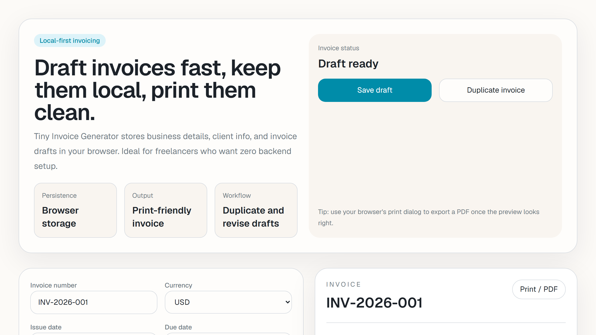

# Tiny Invoice Generator

Tiny Invoice Generator is a local-first Next.js app for drafting invoices, saving them in browser storage, and exporting clean print-ready PDFs through the browser print flow.

## Screenshot



## Why it exists

Freelancers often need something lighter than a full SaaS billing platform. This project focuses on the practical middle ground: fast invoice drafting, local persistence, and a polished print view without accounts, subscriptions, or backend setup.

## Demo workflow

1. Fill in business details and client information.
2. Add line items, tax, discount, notes, and payment instructions.
3. Save the draft locally, duplicate it for revisions, and export to PDF through browser print.

## Features

- Local business profile and client details
- Invoice metadata, notes, payment instructions, tax, and discount fields
- Editable line items with calculated totals
- Duplicate invoice workflow for quick revisions
- Print-friendly preview for browser PDF export
- Remove line items cleanly during draft editing

## Portfolio value

- shows a useful local-first workflow instead of a toy landing page
- demonstrates calculation helpers with tests
- includes realistic open-source hygiene: CI, issues, PR templates, changelog, and releases

## Tech Stack

- Next.js 16 App Router
- React 19
- TypeScript
- Tailwind CSS 4
- Vitest

## Getting Started

```bash
npm install
npm run dev
```

Open `http://localhost:3000`.

## Verification

```bash
npm run test
npm run lint
npm run typecheck
npm run build
```

## Roadmap

See `docs/ROADMAP.md`.

## Contributing

Small workflow improvements are welcome. Open an issue before large UX or document-model changes so invoice behavior stays predictable.

## Release

See `docs/RELEASE_CHECKLIST.md`.

## License

MIT
